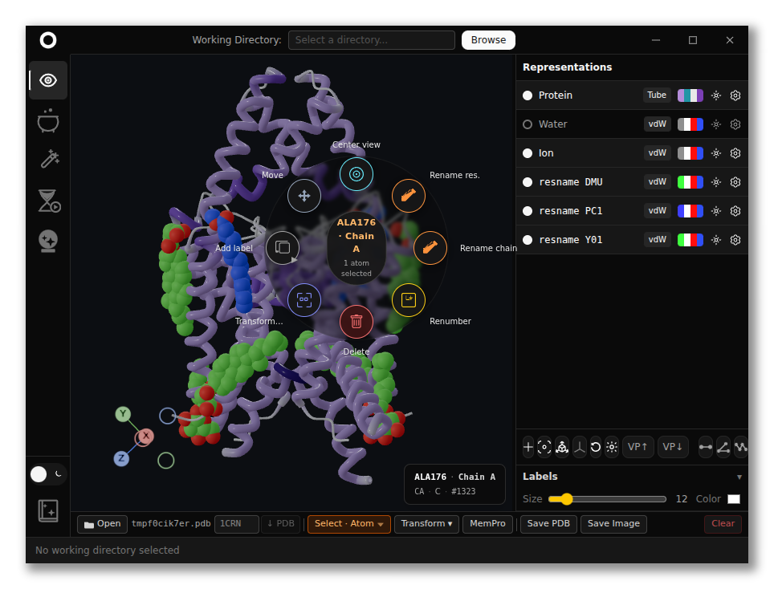

# GateWizard GUI


Desktop application for membrane protein preparation, system building, equilibration setup, and MD trajectory analysis

**This repository is the GUI only.** It is independent from the Python API and is distributed on its own.

The app uses the **[GateWizard API](https://github.com/maurobedoya/gatewizard)** under the hood. You do not need to clone the API repo to run the GUI, it installs `gatewizard` into its embedded Python environment. You can also use the API alone from Python or Jupyter without this app.

[](./resources/readme/main_viewer.png)

<br clear="left" />

## Features

- **Preparation** — clean structures, pKa (PROPKA), protonation, and termini capping
- **Membrane builder** — orient protein, pack lipids and solvent, Amber parametrization (tleap)
- **Equilibration** — CHARMM-GUI-style protocols for NAMD, GROMACS, and OpenMM (NVT, NPT, NPAT, NPγT)
- **Analysis** — trajectory metrics, structural analysis, and plotting helpers
- **Force fields** — Amber protein models (e.g. ff14SB, ff19SB) and common water/lipid setups
- **Cross-platform** — Linux, Windows, and macOS installers

## Install

Download the installer for your platform from [Releases](https://github.com/franciscoadasme/gatewizard-gui/releases).

**First launch** downloads Python packages in the background (several minutes). Keep the splash screen open — progress is shown there. Logs: `%APPDATA%\gatewizard-gui\runtime-install.log` (Windows) or `~/.config/gatewizard-gui/runtime-install.log` (Linux).

### Windows

1. Run `gatewizard-gui-*-win-x64-setup.exe`
2. Open **GateWizard GUI (Windows)** from the Start menu or desktop
3. Wait on the splash screen until the main window appears (first run: 5–15 min)
4. **Full MD workflow** (membrane builder, AmberTools): use the **Linux/WSL** build on the same PC

### Linux / WSL

**`.deb` (Ubuntu/Debian/WSL):**
```bash
sudo apt install ./gatewizard-gui-*-linux-amd64.deb
gatewizard-gui-linux
```

**AppImage:**
```bash
chmod +x gatewizard-gui-*-linux-x86_64.AppImage
./gatewizard-gui-*-linux-x86_64.AppImage
```

Do **not** run `gatewizard` in the terminal — that is the Python API CLI, not this app.

### macOS

1. Open the `.dmg`, drag **`gatewizard-gui-mac.app`** to **Applications**
2. Open from **Applications** (not from the DMG)
3. If macOS blocks it: `xattr -cr /Applications/gatewizard-gui-mac.app`

Update the API later from **Grimoire → Dependency Versions → Check for updates**.

## Dependencies

GateWizard is split across two repositories ([API](https://github.com/maurobedoya/gatewizard) + this GUI). Below is the **full dependency stack**; subsections mark what **this repo** installs automatically.

### Python — core (`pip install gatewizard`) · *[gatewizard](https://github.com/maurobedoya/gatewizard)*

| Package | Role |
|---------|------|
| Python ≥ 3.8 | Runtime |
| NumPy | Numerical arrays |
| Matplotlib | Plots and analysis figures |
| MDAnalysis | Trajectories and topologies |
| lipyphilic | Membrane / lipid analysis |
| PROPKA | pKa and protonation |
| RDKit | Ligand 2D structures |
| Pillow | Image I/O |
| psique | Structure / sequence tools |
| requests | HTTP helpers |

### Python — optional `[full]` · *API; installed via embedded runtime*

| Package | Role |
|---------|------|
| ParmEd | Topology conversion (GROMACS, etc.) |
| OpenMM | Equilibration / MD (Python; use with conda `cudatoolkit` for GPU) |
| MemPrO | Membrane orientation ([GitHub](https://github.com/pstansfeld/MemPrO)) |

### Python — GUI backend · *this repo (embedded runtime)*

| Package | Role |
|---------|------|
| Python 3.12 | Embedded micromamba env |
| FastAPI | Local HTTP API |
| Uvicorn | ASGI server |
| gatewizard[full] | GateWizard API (pip, from `backend/requirements.txt`) |

### Conda (embedded runtime · automatic on first start)

| Package | Linux / WSL | macOS | Native Windows |
|---------|-------------|-------|----------------|
| AmberTools 24 | yes | yes | no — use WSL |
| OpenMM (conda) | yes | yes | no |
| cudatoolkit (OpenMM CUDA) | yes | no (Metal) | no |

After `pip install gatewizard[full]`, the app re-syncs conda OpenMM packages on Linux/WSL so GPU support is kept.

Same packages are in the API [`environment.yml`](https://github.com/maurobedoya/gatewizard/blob/main/environment.yml) for conda-based API installs.

### Desktop app · *this repo (`npm install` / installer)*

| Package | Role |
|---------|------|
| Electron | Desktop shell |
| Node.js 20+ | App and build runtime |
| Svelte 5 | UI framework |
| Vite | Frontend bundler |
| Tailwind CSS | Styling |
| Three.js + Threlte | 3D structure viewer |
| electron-updater | In-app update checks |

### External MD engines (install separately · neither repo)

| Tool | Role |
|------|------|
| [NAMD](https://www.ks.uiuc.edu/Research/namd/) | Run NAMD equilibration — `namd3` / `namd2` on `PATH` |
| [GROMACS](https://www.gromacs.org/) | Run GROMACS equilibration — `gmx` on `PATH` |

OpenMM needs no separate binary — provided by `gatewizard[full]` + conda above. Check platforms on **Equilibration → OpenMM** after install.

### Provided by this repository

| Component | Included |
|-----------|----------|
| Desktop app (Electron, Svelte, Three.js viewer) | yes |
| Embedded Python + FastAPI backend | yes |
| `gatewizard[full]` (pip) | yes — on first start / API update |
| AmberTools, OpenMM, cudatoolkit (conda) | Linux/WSL/macOS only |
| NAMD / GROMACS binaries | no — user install |
| Standalone API package source | no — [gatewizard](https://github.com/maurobedoya/gatewizard) |

### Platform notes

| Platform | Full workflow (builder, equilibration) |
|----------|----------------------------------------|
| Linux / WSL | Yes |
| macOS | Yes, where AmberTools is available |
| Native Windows | Limited — no AmberTools in embedded runtime; OpenMM GPU not set up by the installer; use WSL for full MD |

### Python API (optional)

If you prefer scripts or notebooks without the desktop app: **[github.com/maurobedoya/gatewizard](https://github.com/maurobedoya/gatewizard)**

```bash
pip install gatewizard
```

## Development

Requirements: **Node.js 20+**, **npm**. For the full MD workflow, use **Linux or WSL** (AmberTools and related tools).

```bash
git clone https://github.com/maurobedoya/gatewizard-gui.git
cd gatewizard-gui
npm install
npm run dev
```

On WSL if GPU/display issues appear:

```bash
npm run dev:wsl
```

Install `npm` dependencies in **one environment only** (WSL or Windows), not both on the same folder.

### Build installers

| Platform | Command | Release artifact (example) |
|----------|---------|----------------------------|
| Linux / WSL | `npm run build:linux` | `gatewizard-gui-1.0.2-linux-x86_64.AppImage`, `.deb` |
| Windows | `npm run build` then `npm run build:win:pack` | `gatewizard-gui-1.0.2-win-x64-setup.exe` |
| macOS | `npm run build:mac` (on macOS) | `gatewizard-gui-1.0.2-mac-arm64.dmg` |

Installers use platform suffixes (`-win-`, `-linux-`, `-mac-`) so Windows and WSL/Linux builds are easy to tell apart on one machine.
